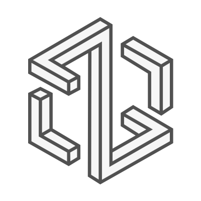
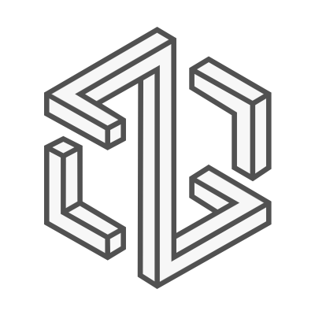
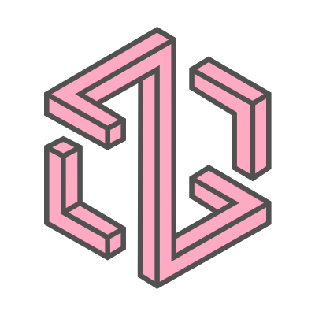
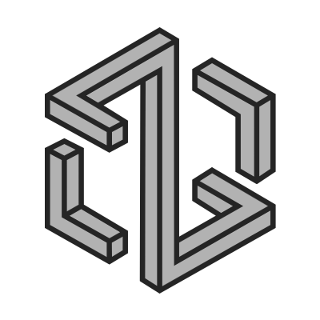

# ln1头像仓库

该仓库是ln1头像的合集.

## 头像

| 头像 | 文件名 |
|---|---|
|  | `ln1-Avatar.png` |
|  | `ln1-Avatar-simple.png` |
|  | `ln1-Avatar-Alipay.png` |
|  | `ln1-Avatar-Bilibili.png` |
|  | `ln1-Avatar-MicroSoft-full.png` |
|  | `ln1-Avatar-Microsoft.png` |
|  | `ln1-Avatar-SWJTU.png` |
|  | `ln1-Avatar-Telegram-dark.png` |
|  | `ln1-Avatar-Telegram-light.png` |
|  | `ln1-Avatar-TikTok.png` |
|  | `ln1-Avatar-TikTok-Simple.png` |
|  | `ln1-Avatar-X.png` |
|  | `ln1-Avatar-SteelBlueGray.svg` |
